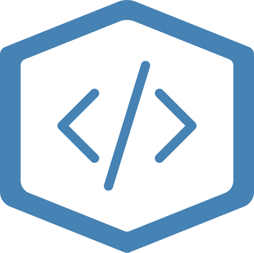

<!-- ===== HEADER ===== -->

    

<h1 align="center">
    <strong>WebBox</strong> Projects
      
</h1>

<!-- ===== MAIN CONTENT ===== -->

## 🚀 Main Projects

A suite of tools and components that power the WebBox ecosystem.

| Project | Description |
|---------|-------------|
| [`webbox-runtime`](https://github.com/webboxcore/webbox-runtime) | The core Rust-based runtime that powers all `.wapp` apps via micro-VMs and native WebView rendering. |
| [`webbox-core`](https://github.com/webboxcore/webbox-core) | A GUI app for managing installed WebBox Apps, launching VMs, and configuring your system. |
| [`webbox-platform`](https://github.com/webboxcore/webbox-platform) | The Laravel backend powering the WebBox Store, user accounts, app publishing, and platform logic. |
| [`webbox-installer`](https://github.com/webboxcore/webbox-installer) | Cross-platform native installers that bootstrap WebBox onto Windows, macOS, and Linux systems. |

<!-- ===== FOOTER ===== -->

    <small>
        Developed in Cornwall 
        &copy; 2025 <a href="https://opticalraze.com" target="_blank" rel="noopener noreferrer">Optical Raze Inc.</a>
    </small>

